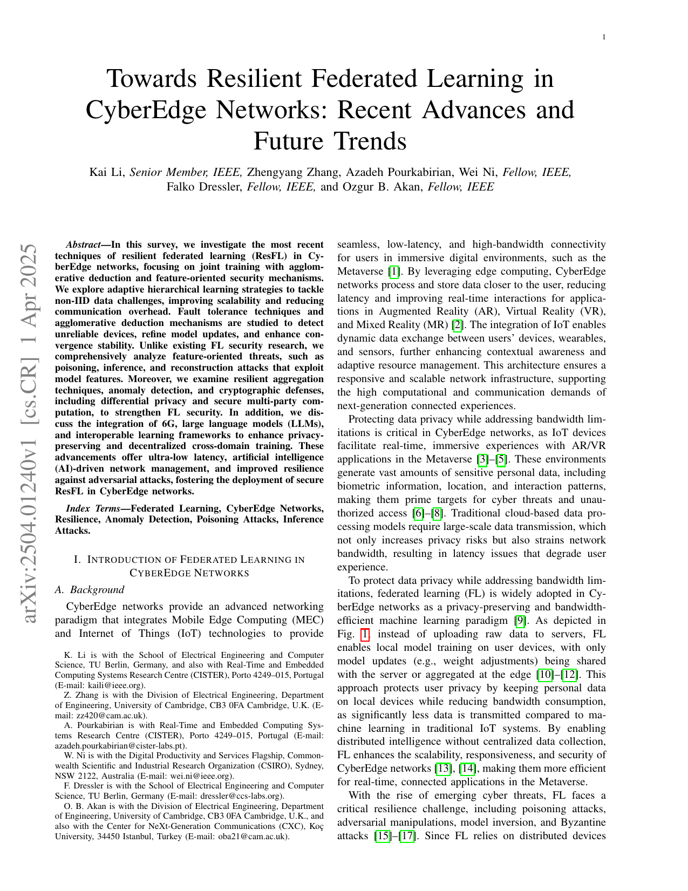

## Towards Resilient Federated Learning in CyberEdge Networks: Recent Advances and Future Trends

**類別：** Edge AI Security（Review Paper）
**來源：** arXiv
**發表年份：** 2025
**作者：** 作者群見原文
**連結：** https://arxiv.org/abs/2504.01240

### Figures/Diagrams（圖片）

> 圖片說明：由論文 PDF 擷取首頁作為來源對照圖。

### NotebookLM 摘要
您好，我是專精於分散式學習與邊緣運算的領域專家。這篇論文《Towards Resilient 
Federated Learning in CyberEdge Networks: Recent Advances and Future 
Trends》是一篇非常及時且全面的綜述，對於想深入了解如何構建具備「韌性」的聯邦學習
系統非常有幫助 [1]。

以下我針對這篇論文為您進行深入的結構化分析：

### 1. 論文基本資訊
*   **論文標題：** Towards Resilient Federated Learning in CyberEdge Networks: 
Recent Advances and Future Trends [1]。
*   **作者：** Kai Li, Zhengyang Zhang, Azadeh Pourkabirian, Wei Ni, Falko 
Dressler, Ozgur B. Akan [1]。
*   **發表年份：** 2025 年 [1]。
*   **發表會議 / 期刊：** arXiv 預印本（標註為 Journal paper） [1, 2]。
*   **研究領域：** 韌性聯邦學習 (Resilient Federated Learning, 
ResFL)、網路邊緣安全 (CyberEdge Security) [1, 2]。

### 2. 這篇 Review Paper 在整理什麼領域？
這篇論文深入探討在 **CyberEdge 
網路**環境下，如何透過分層學習、故障容錯與特徵導向的安全機制，建立具有**韌性（Re
silience）**的聯邦學習架構，以應對設備不穩定與惡意攻擊 [1]。

### 3. 為什麼這個領域重要？
*   **解決什麼問題：** 
解決傳統聯邦學習在邊緣網路中面臨的設備不可靠、數據非獨立同分佈 
(non-IID)、通訊開銷過大，以及針對模型特徵的惡意攻擊（如投毒或隱私竊取） [1]。
*   **為什麼現在需要研究它：** 隨著 6G 
與物聯網發展，資料產生在邊緣端且隱私敏感，需要在分散式環境下確保學習過程的穩定性
與安全性 [1]。
*   **目前有哪些挑戰：** 
包含數據異質性導致的收斂不穩、惡意參與者對模型特徵的精準攻擊，以及跨域協作中的互
操作性問題 [1]。

### 4. 這篇 paper 的整體分類方式（Taxonomy）

**Category 1: 訓練架構與系統穩定性 (Training Architecture & Stability)**
*   **方法名稱：** 自適應分層學習與故障容錯 (Adaptive Hierarchical Learning & 
Fault Tolerance) [1]。
*   **核心概念：** 
採用分層架構降低通訊負擔，並利用偵測機制識別不可靠設備，優化模型更新與收斂穩定性
[1]。
*   **代表論文：** 論文中探討了針對 non-IID 數據的分層優化與設備異常檢測技術 
[1]。

**Category 2: 特徵導向的安全威脅 (Feature-oriented Threats)**
*   **方法名稱：** 投毒、推論與重構攻擊分析 (Poisoning, Inference, and 
Reconstruction Attacks) [1]。
*   **核心概念：** 
針對攻擊者如何利用模型特徵（Features）來篡改模型行為或反向推導原始數據的技術進行
分類 [1]。
*   **代表論文：** 論文詳細分析了各類針對特徵層面的對抗攻擊機制 [1]。

**Category 3: 韌性防禦與隱私機制 (Resilient Defense & Privacy)**
*   **方法名稱：** 韌性聚合與密碼學防禦 (Resilient Aggregation & Cryptographic 
Defenses) [1]。
*   **核心概念：** 整合差異隱私 (DP)、安全多方計算 (SMC) 
與韌性聚合演算法，在確保隱私的前提下過濾惡意更新 [1]。
*   **代表論文：** 論文探討了結合密碼學工具與 AI 驅動的異常檢測防禦方案 [1]。

### 5. 各類方法的比較

| 方法類型 | 核心技術 | 優點 | 缺點 | 適用場景 |
| :--- | :--- | :--- | :--- | :--- |
| **分層學習** | 自適應層級劃分 [1] | 降低通訊開銷、可擴展性高 [1] | 
架構複雜度增加 [1] | 大規模、頻寬受限的邊緣網路 |
| **韌性聚合** | 異常檢測與過濾 [1] | 抵禦投毒攻擊、提升穩定性 [1] | 
可能誤傷部分 non-IID 更新 [1] | 存在惡意參與者的對抗環境 |
| **密碼學防禦** | 差異隱私 (DP)、SMC [1] | 強大的數學隱私保證 [1] | 
額外計算負擔、影響精確度 [1] | 高隱私需求（如醫療、金融） |

### 6. 這個領域目前的主流技術有哪些？
*   **主流技術：** 異常檢測 (Anomaly detection)、差異隱私 (Differential 
Privacy)、以及針對 non-IID 數據的優化演算法 [1]。
*   **新興技術：** **6G 整合**、**大型語言模型 (LLMs)** 
輔助網路管理、互操作性學習框架 [1]。
*   **正在被淘汰：** 
傳統的中央集權式訓練（在邊緣場景下）以及缺乏韌性考量的簡單平均聚合方法 [1]。

### 7. 目前最重要的技術挑戰 (Challenges)
*   **Non-IID 數據挑戰：** 邊緣設備數據分佈不均影響模型收斂 [1]。
*   **通訊開銷 (Communication overhead)：** 頻寬限制影響大規模部署 [1]。
*   **特徵層面攻擊 (Feature-oriented threats)：** 如重構攻擊可威脅數據隱私 [1]。
*   **收斂穩定性 (Convergence stability)：** 設備故障或退出導致訓練中斷 [1]。
*   **擴展性 (Scalability)：** 在極大規模 CyberEdge 網路中的協作效率 [1]。

### 8. 未來研究方向 (Future Research Directions)
*   **Short-term research direction:** 
提升韌性聚合技術的精準度、開發針對特徵攻擊的輕量化防禦機制 [1]。
*   **Long-term research direction:** **6G 原生 AI** 的自動化網路管理、基於 
**LLM** 的隱私保護跨域訓練、超低延遲的韌性架構 [1]。

### 9. 如果我要做研究，這篇 review paper 給我的啟發是什麼？
*   **可能的研究題目：** 「基於 LLM 優化的 6G 
邊緣網路韌性聯邦學習框架」或「針對異質設備的自適應分層隱私保護機制」。
*   **研究 Gap：** 論文提到「跨域訓練的互操作性」以及「6G 
環境下的極低延遲韌性」仍有待深入開發 [1]。
*   **可以改進的地方：** 
目前防禦機制往往在「隱私、安全性、效能」三者間難以平衡，如何利用 AI 
驅動的管理來動態調整這些參數是一個很好的方向 [1]。

### 10. 用 5 句話摘要整篇 review paper
1. 本論文綜述了在 CyberEdge 網路中實現韌性聯邦學習 (ResFL) 的關鍵技術進展 [1]。
2. 重點討論了如何透過分層學習與故障容錯機制，解決設備不穩定與數據 non-IID 
帶來的收斂問題 [1]。
3. 深入分析了針對模型特徵的投毒、推論與重構攻擊等新興安全威脅 [1]。
4. 介紹了結合差異隱私、安全多方計算與韌性聚合的多元防禦體系 [1]。
5. 最後前瞻性地探討了 
6G、大型語言模型與互操作性框架在提升未來聯邦學習韌性中的潛力 [1]。

Sources:
  [1] [2504.01240] Towards Resilient Federated Learning in CyberEdge Networks: 
Recent Advances and Future Trends

Conversation ID: 7b99818c-8aeb-45be-8fe1-90ddb0c21764
Use --conversation-id for follow-up questions

### Review Methodology Synthesis（Review Paper）
- **問題/領域：** CyberEdge 聯邦學習中的安全韌性與攻防協同。
- **Taxonomy：** 攻擊模型、防禦機制、系統韌性管理。
- **各方法優缺點：**
1. 強韌聚合抗攻擊佳但可能降收斂效率。
2. 隱私保護強但額外計算與通訊成本高。
3. 信任評分機制實務性高但易被策略型攻擊繞過。
- **主流方法：** Byzantine-robust aggregation、差分隱私、安全聚合。
- **可延伸方向：** 真實網路條件下的大規模攻防共測。

### Extension Suggestions（可延伸建議）
1. 建立可比較的 CyberEdge 攻防實驗標準。
2. 研究動態信任更新與惡意節點隔離。
3. 強化低頻寬環境下的安全聚合效率。

### Credibility Assessment（可信度評估與理由）
**評級：中（Medium）**
- 優點：主題切中邊緣資安需求，內容具前瞻性。
- 限制：預印本階段，部分實證尚待延伸驗證。
