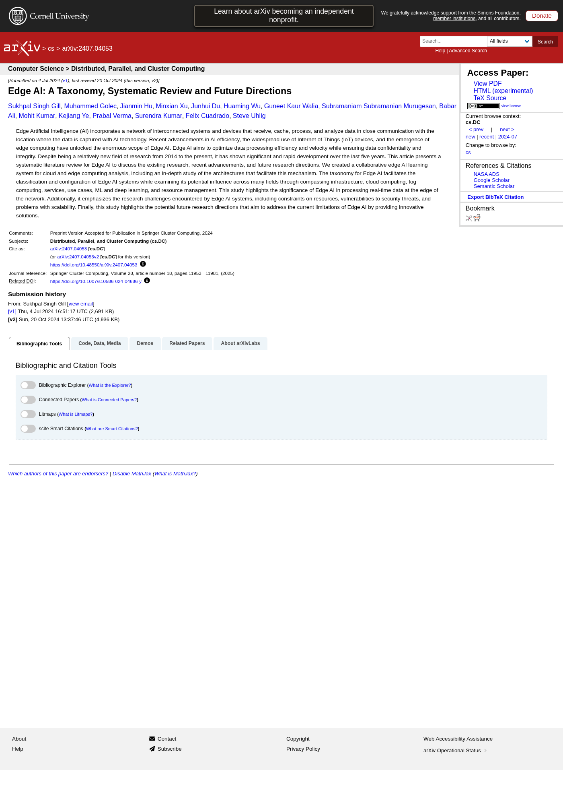

## Edge AI: A Taxonomy, Systematic Review and Future Directions

**類別：** Edge AI（Review Paper）
**來源：** arXiv
**發表年份：** 2024
**作者：** Yingzhan Ma 等
**連結：** https://arxiv.org/abs/2407.04053

### Figures/Diagrams（圖片）

> 圖片說明：由論文網頁截圖擷取作為來源對照圖。

### NotebookLM 摘要
您好！我是該領域的研究專家。這篇論文《**Edge AI: A Taxonomy, Systematic Review 
and Future Directions**》是一篇針對邊緣人工智慧（Edge 
AI）領域非常全面且具參考價值的文獻綜述。這篇論文系統性地回顧了從 2014 
年至今的發展，特別聚焦於近五年的爆發式增長 [1]。

以下我將針對這篇論文進行深度的結構化分析：

### 1. 論文基本資訊
- **論文標題**：Edge AI: A Taxonomy, Systematic Review and Future Directions [2]
- **作者**：Sukhpal Singh Gill, Muhammed Golec, Jianmin Hu 等 [2]
- **發表年份**：2025 年（Journal version） [3]
- **發表會議 / 期刊**：Springer Cluster Computing [3]
- **研究領域**：分散式、平行與叢集運算（Distributed, Parallel, and Cluster 
Computing），具體聚焦於邊緣運算與人工智慧的結合 [1, 4]

### 2. 這篇 Review Paper 在整理什麼領域？
這篇論文致力於整理 **Edge AI（邊緣人工智慧）** 
領域，探討如何在靠近數據源的網路邊緣端進行高效、即時且安全的數據處理與分析 [1]。

### 3. 為什麼這個領域重要？
- 
**解決的問題**：它旨在優化數據處理的效率與速度，減少將大量數據回傳雲端產生的延遲
，同時確保數據的機密性與完整性 [1]。
- **研究必要性**：隨著 AI 
效率的提升、物聯網（IoT）設備的普及以及邊緣運算技術的成熟，業界需要一種能在本地
端即時處理數據的機制 [1]。
- **目前挑戰**：主要挑戰包括邊緣設備的**資源受限**（Resource 
constraints）、易受攻擊的**安全威脅**（Security 
threats）以及系統的**擴展性問題**（Scalability） [1]。

### 4. 這篇 Paper 的整體分類方式（Taxonomy）
論文根據系統架構與功能，將 Edge AI 分為以下三大核心類別 [1]：

*   **Category 1: 運算基礎設施（Infrastructure & Computing）**
    *   
**核心概念**：涵蓋雲端運算（Cloud）、霧端運算（Fog）與邊緣端（Edge）的層次結構。
    *   **重點**：研究數據如何在不同層級之間接收、快取與處理 [1]。

*   **Category 2: 學習與演算法技術（ML and Deep Learning）**
    *   **核心概念**：針對邊緣環境優化的機器學習與深度學習模型。
    *   **重點**：包含協同學習機制，探討如何在雲端與邊緣之間分配計算負載 [1]。

*   **Category 3: 資源管理與應用服務（Resource Management & Services）**
    *   **核心概念**：針對受限資源的調度與具體應用場景。
    *   **重點**：分析邊緣 AI 在不同領域（Use cases）的配置與資源優化策略 [1]。

### 5. 各類方法的比較（基於論文背景推論）

| 方法類型 | 核心技術 | 優點 | 缺點 | 適用場景 |
| :--- | :--- | :--- | :--- | :--- |
| **Edge-only** | 本地端推論 | 極低延遲、高隱私 | 計算能力極其有限 | 
簡單感測器、即時開關 |
| **Cloud-Edge 協作** | 雲邊協同學習 [1] | 平衡運算量與精準度 | 依賴網路穩定性 |
智慧監控、自動駕駛 |
| **Fog Computing** | 分層式處理 [1] | 較好的擴展性 | 架構管理複雜 | 
智慧城市、工業物聯網 |

### 6. 這個領域目前的主流技術有哪些？
根據論文描述，目前的技術趨勢如下：
- **主流技術**：**深度學習（Deep Learning）**與**機器學習（ML）**是核心驅動力 
[1]。
- **新興技術**：**雲邊協同學習系統（Collaborative Edge AI Learning 
System）**，這是論文重點討論的創新架構 [1]。
- **演進方向**：從單純的「雲端中心化」處理轉向「分散式邊緣處理」 [1]。

### 7. 目前最重要的技術挑戰（Challenges）
論文列出了以下關鍵挑戰 [1]：
1.  **資源受限（Resource constraints）**：邊緣設備的電力、內存與運算力不足。
2.  **安全漏洞（Security threats）**：設備分佈廣泛，易受攻擊，需確保數據完整性。
3.  **擴展性問題（Scalability）**：當連接設備數量劇增時，系統難以維持效能。
4.  **數據機密性（Data confidentiality）**：在邊緣端處理敏感數據的隱私保護。
5.  **即時處理需求（Real-time processing）**：在高動態環境下維持極低延遲。

### 8. 未來研究方向（Future Research Directions）
論文提出了以下展望 [1]：
- **Short-term (短期)**：優化現有的資源管理策略，解決當前的安全漏洞。
- **Long-term (長期)**：
    *   開發創新的**協同學習架構**。
    *   設計專為邊緣端打造的**輕量化 AI 模型**。
    *   探索跨領域的 Edge AI 應用整合。

### 9. 如果我要做研究，這篇 Review Paper 給我的啟發？
- **可能的研究題目**：
    1. 「針對資源受限邊緣設備的輕量化協同學習框架」
    2. 「邊緣 AI 系統中的數據隱私與安全性強化機制」
- **研究 Gap**：目前的挑戰在於如何在「極低資源」與「高精準度 AI」之間取得平衡 
[1]。
- **可以改進的地方**：可以針對特定的**應用場景（Use cases）**（如醫療或工業 
4.0）開發更具針對性的資源調度演算法 [1]。

### 10. 用 5 句話摘要整篇 Review Paper
這篇論文為快速發展的邊緣人工智慧（Edge AI）領域提供了系統性的回顧與分類框架 
[1]。它詳細探討了 AI 
技術如何與邊緣運算整合，以實現高效、即時且安全的本地數據處理 
[1]。透過分類學（Taxonomy），論文分析了基礎設施、機器學習演算法及資源管理等關鍵
維度 [1]。研究特別指出了邊緣設備在資源、安全與擴展性上所面臨的重大技術挑戰 
[1]。最後，論文提出了一套雲邊協同學習架構，並為未來的研究方向提供了創新的導引路
徑 [1]。

Sources:
  [1] [2407.04053] Edge AI: A Taxonomy, Systematic Review and Future Directions

Conversation ID: d82763d9-db7a-4d58-b162-39712b8aa908
Use --conversation-id for follow-up questions

### Review Methodology Synthesis（Review Paper）
1. 問題／領域：此綜述聚焦 Edge AI 整體生態，整理從架構到部署的關鍵問題。

2. Taxonomy：以系統層、模型層、應用層進行分類，對齊研究脈絡。

3. 各方法優缺點：比較不同方法在效能、能耗與可部署性的取捨。

4. 主流方法：歸納模型壓縮、硬體感知訓練與協同設計等主流路線。

5. 延伸方向：建議建立跨平台評測基準與安全導向部署流程。

### Extension Suggestions（可延伸建議）
1. 針對跨晶片平台建立可重現 benchmark。

2. 強化模型壓縮與魯棒性聯合最佳化。

3. 引入資安情境（模型竄改、資料投毒）進行端到端評測。

### Credibility Assessment（可信度評估與理由）
**評級：中高（Medium-High）**
- 優點：主題完整、分類明確，對後續研究選題有高參考價值。
- 限制：預印本性質仍需搭配後續同行評審版本交叉驗證。
