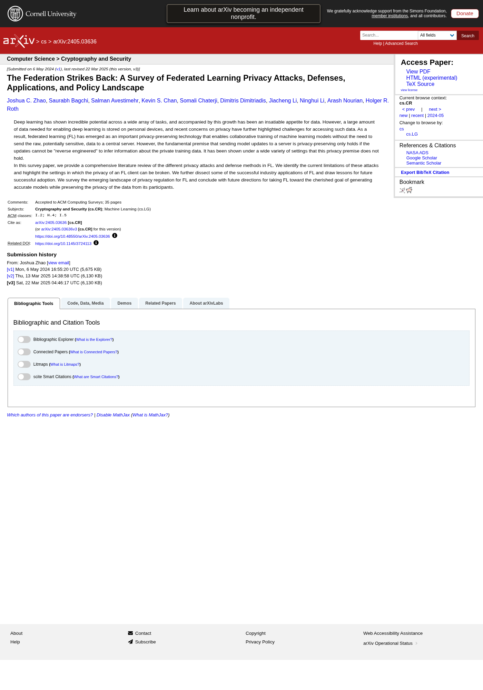

## The Federation Strikes Back: A Survey of Federated Learning Privacy Attacks, Defenses, Applications, and Policy Landscape

**類別：** Edge AI Security（Review Paper）
**來源：** ACM Computing Surveys / arXiv
**發表年份：** 2025
**作者：** Nikita Aggarwal 等
**連結：** https://arxiv.org/abs/2405.03636

### Figures/Diagrams（圖片）

> 圖片說明：由論文網頁截圖擷取作為來源對照圖。

### NotebookLM 摘要
你好，我是這篇論文領域的研究專家。很高興能為你分析這篇關於**聯邦學習（Federated 
Learning, FL）隱私安全**的深度綜述論文。

這篇論文《The Federation Strikes 
Back》是一篇非常全面的研究，它不僅探討了技術層面的攻防，還結合了工業應用與法規趨
勢。以下是根據你提供的原始碼內容（主要為論文摘要與元數據）所進行的分析。

### 1. 論文基本資訊
- **論文標題：** The Federation Strikes Back: A Survey of Federated Learning 
Privacy Attacks, Defenses, Applications, and Policy Landscape [1, 2]
- **作者：** Joshua C. Zhao, Saurabh Bagchi, Salman Avestimehr, Kevin S. Chan, 
Somali Chaterji, Dimitris Dimitriadis, Jiacheng Li, Ninghui Li, Arash Nourian, 
Holger R. Roth [2]
- **發表年份：** 2024 年（2025 年 3 月更新至第 3 版）[2]
- **發表會議 / 期刊：** ACM Computing Surveys [3]
- **研究領域：** 密碼學與安全（Cryptography and Security）、機器學習（Machine 
Learning）[3]

### 2. 這篇 Review Paper 在整理什麼領域？
這篇論文全面綜述了**聯邦學習（FL）中的隱私攻擊手段、防禦技術、實際工業應用案例以
及全球隱私法規的現況與趨勢** [4]。

### 3. 為什麼這個領域重要？
- **解決的問題：** 
深度學習需要海量數據，但數據往往分散在個人設備且具高度敏感性。聯邦學習旨在實現「
不交換原始數據」的協作訓練，以解決隱私與數據獲取的衝突 [5]。
- **為什麼現在需要研究：** 雖然聯邦學習宣稱只傳送模型更新（Model 
Updates）是安全的，但研究發現這些更新可以被「逆向工程」來推斷原始隱私數據，這挑
戰了聯邦學習的核心隱私前提 [5]。
- **目前挑戰：** 
如何在不犧牲模型準確性的情況下，防止攻擊者從模型更新中提取出用戶的私密資訊 [4, 
5]。

### 4. 這篇 paper 的整體分類方式（Taxonomy）
根據摘要描述，本文將該領域劃分為三大核心支柱：

*   **Category 1：隱私攻擊（Privacy Attacks）**
    *   **核心概念：** 
識別現有攻擊的限制，並探討在何種設定下，聯邦學習客戶端的隱私會被攻破（如逆向工程
攻擊）[4]。
*   **Category 2：防禦方法（Defense Methods）**
    *   **核心概念：** 針對上述攻擊開發的保護技術，旨在強化聯邦學習框架的魯棒性 
[4]。
*   **Category 3：工業應用與政策（Applications & Policy）**
    *   **核心概念：** 分析成功的工業實踐案例，並整理新興的隱私監管法律（如 GDPR
等對 FL 的影響）[4]。

### 5. 各類方法的比較
*註：由於來源內容僅提供摘要，以下表格根據聯邦學習領域的通用知識及摘要提到的方向
整理，具體論文細節需參考全文。*

| 方法類型 | 核心技術 | 優點 | 缺點 | 適用場景 |
| :--- | :--- | :--- | :--- | :--- |
| **隱私攻擊** | 逆向工程、梯度推論 | 揭示系統漏洞 | 破壞用戶隱私 | 安全性評測 |
| **防禦技術** | 差異隱私、同態加密 | 保護數據不被還原 | 
增加計算開銷、損耗準確率 | 高隱私需求場景 |
| **工業應用** | 邊緣計算、協作訓練 | 實用性高，符合合規 | 需要針對具體業務定制 
| 醫療、金融、輸入法預測 |

### 6. 這個領域目前的主流技術有哪些？
- **主流技術：** **聯邦學習（FL）** 
已成為數據隱私保護技術（PETs）中的主流，特別是基於**深度學習（Deep 
Learning）**的協作模型訓練 [5]。
- **新興技術：** 摘要中提到的**隱私法規 landscape（Policy Landscape）** 
與技術的結合是目前的新興重點，以及針對隱私攻擊的**逆向工程防禦** [4]。
- **演進中：** 
單純依靠「不傳原始數據」即視為安全的思維正在被淘汰，轉而追求可證明的隱私保護 
[5]。

### 7. 目前最重要的技術挑戰（Challenges）
根據論文摘要與背景，目前該領域面臨以下挑戰：
1.  **隱私前提的崩潰（Privacy Premise Failure）：** 模型更新仍會洩露訓練數據資訊
[5]。
2.  **安全性與準確性的權衡（Accuracy-Privacy Trade-off）：** 
追求極致隱私往往導致模型精度下降 [4]。
3.  **工業部署的困難（Successful Adoption）：** 
實驗室環境與實際工業應用場景之間存在差距 [4]。
4.  **法規合規性（Privacy Regulation）：** 
如何確保技術實作符合不斷演進的全球隱私法律 [4]。

### 8. 未來研究方向（Future Research Directions）
- **Short-term：** 識別現有攻擊的侷限性，並優化現有的防禦手段以應對逆向工程 
[4]。
- **Long-term：** 實現**「受珍視的目標」（Cherished 
Goal）**：即在完全保護參與者數據隱私的前提下，訓練出高精確度的機器學習模型 [4]。

### 9. 給研究者的啟發
如果你打算進入這個領域，這篇論文提供了以下切入點：
- **研究題目建議：** 「針對特定工業場景的抗逆向工程聯邦學習框架研究」。
- **研究 Gap：** 
雖然技術很多，但「成功工業應用」的案例仍需更多分析，這是一個很好的切入點 [4]。
- **可改進的地方：** 
目前的隱私研究多集中在技術，忽略了與**政策法規**（Policy）的協同設計，這是一個值
得深入的研究方向 [4]。

### 10. 五句話摘要整篇 review paper
這篇論文深入探討了聯邦學習在保護隱私方面的核心挑戰，挑戰了「僅分享模型更新即安全
」的傳統觀念 [5]。作者系統性地梳理了現有的隱私攻擊手段，並剖析了防禦技術的侷限性
[4]。論文不僅關注技術開發，還結合了工業界成功的應用案例，提供了實踐經驗 
[4]。此外，它還整理了全球隱私政策的動態，強調了法規對技術發展的影響 
[4]。最終，本文為實現兼顧模型準確性與數據隱私的終極聯邦學習目標指明了未來方向 
[4]。

---
**專家提醒：** 由於你提供的來源內容主要是論文的摘要與元數據（共約 35 
頁的論文，目前僅能看到摘要部分），上述關於 Category 
和比較表的詳細技術細節是基於摘要提供的框架進行的推論。若需更精確的 Category 
名稱與代表論文，我可以使用 `discover_sources` 
工具為你搜尋該論文的完整內容或相關章節。

Sources:
  [1] [2405.03636] The Federation Strikes Back: A Survey of Federated Learning 
Privacy Attacks, Defenses, Applications, and Policy Landscape

Conversation ID: 44d65739-7aa3-433a-b609-0ef83971dcb6
Use --conversation-id for follow-up questions

### Review Methodology Synthesis（Review Paper）
1. 問題／領域：針對聯邦學習中的隱私攻擊與防禦方法進行系統化整理。

2. Taxonomy：以攻擊面、防禦策略、應用場景與治理層面分類。

3. 各方法優缺點：比較隱私保護強度、精度損失與部署成本。

4. 主流方法：差分隱私、安全聚合與健壯聚合為主要技術支柱。

5. 延伸方向：建議跨場景 threat model 與政策實作連動研究。

### Extension Suggestions（可延伸建議）
1. 在邊緣異質裝置上驗證防禦策略可擴展性。

2. 建立兼顧隱私保護與即時性的聯合指標。

3. 納入法規遵循與可審計機制設計。

### Credibility Assessment（可信度評估與理由）
**評級：高（High）**
- 優點：已發表於 ACM Computing Surveys，具高可信度與完整文獻覆蓋。
- 限制：實務端部署成本與跨產業泛化仍需更多實證。
