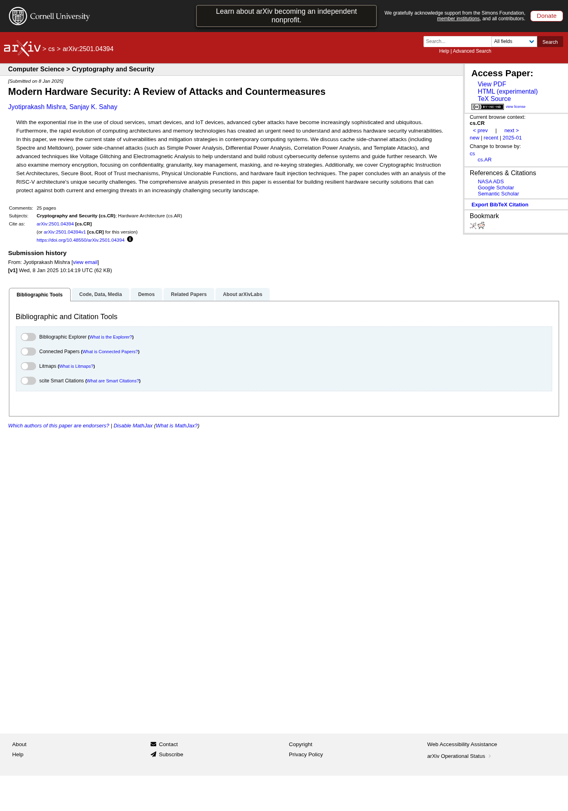

## Modern Hardware Security: A Review of Attacks and Countermeasures

**類別：** Embedded Systems Security（Review Paper）
**來源：** arXiv
**發表年份：** 2025
**作者：** Jyotiprakash Mishra, Sanjay K. Sahay
**連結：** https://arxiv.org/abs/2501.04394

### Figures/Diagrams（圖片）

> 圖片說明：由論文網頁截圖擷取作為來源對照圖。

### NotebookLM 摘要
你好！作為硬體安全領域的研究專家，我將根據這篇 2025 年發表的 review 
paper（arXiv:2501.04394）為你進行深入分析。這篇論文系統性地整理了現代運算環境中
硬體層級的威脅與防護技術，是理解當前硬體安全全貌的重要文獻。

以下是針對該論文的詳細分析：

### 1. 論文基本資訊
- **論文標題：** Modern Hardware Security: A Review of Attacks and 
Countermeasures [1]
- **作者：** Jyotiprakash Mishra, Sanjay K. Sahay [2]
- **發表年份：** 2025 年 (提交日期：2025 年 1 月 8 日) [2]
- **發表會議 / 期刊：** arXiv (預印本，分類於 Cryptography and Security  與 
Hardware Architecture ) [1, 3]
- **研究領域：** 硬體安全 (Hardware Security) [2]

### 2. 這篇 Review Paper 在整理什麼領域？
這篇論文全面綜述了**現代運算系統（含雲端、智慧裝置與 
IoT）中的硬體漏洞、側信道攻擊技術及其對應的硬體防禦與加密機制** [2]。

### 3. 為什麼這個領域重要？
- **解決什麼問題：** 
它處理運算架構中底層的物理與邏輯漏洞，例如數據外洩、非法存取以及透過物理手段（如
功耗、電磁）破解密碼系統的問題 [2]。
- **為什麼現在需要研究它：** 隨著雲端服務與 IoT 
設備的指數級增長，加上運算架構與記憶體技術的快速演進，硬體漏洞變得更加複雜且普遍
，迫切需要更強韌的防禦體系 [2]。
- **目前有哪些挑戰：** 攻擊手段日益精進（如 Spectre/Meltdown），且新興架構（如 
RISC-V）帶來了前所未有的安全考驗，需要在效能與安全性之間取得平衡 [2]。

### 4. 這篇 paper 的整體分類方式（Taxonomy）

**Category 1: 側信道攻擊與故障注入 (Side-Channel Attacks & Fault Injection)**
- **方法名稱：** 物理與微架構攻擊
- **核心概念：** 
透過分析系統運行時的物理特徵（如時間差、功耗、電磁波）或人為干擾硬體運作（如電壓
干擾）來獲取機密資訊 [2]。
- **代表技術：** Spectre、Meltdown、功耗分析 (SPA/DPA/CPA/Template 
Attacks)、電壓干擾 (Voltage Glitching)、電磁分析 (Electromagnetic Analysis) 
[2]。

**Category 2: 硬體層級防禦機制 (Hardware-Based Defenses)**
- **方法名稱：** 安全架構與加密保護
- **核心概念：** 
在硬體設計階段納入加密與完整性校驗，確保系統從啟動到執行的全程安全 [2]。
- **代表技術：** 記憶體加密 (Memory Encryption)、安全啟動 (Secure Boot)、信任根 
(Root of Trust) [2]。

**Category 3: 硬體安全原語與新興架構 (Secure Primitives & Architectures)**
- **方法名稱：** 基礎安全組件與開放架構安全性
- **核心概念：** 
利用硬體獨特的物理特性進行身份驗證，並研究開源指令集架構的安全擴展 [2]。
- **代表技術：** 實體不可複製函數 (PUF)、密碼指令集架構 (Cryptographic 
ISA)、RISC-V 安全架構 [2]。

### 5. 各類方法的比較

| 方法類型 | 核心技術 | 優點 | 缺點 | 適用場景 |
| :--- | :--- | :--- | :--- | :--- |
| **側信道分析** | 快取計時、功耗監測 | 非侵入性，可破解高強度算法 | 
需要精密測量儀器與專業分析 | 安全審計、逆向工程 [2] |
| **記憶體加密** | 資料機密性、遮罩 (Masking) | 保護靜態與動態數據 | 
可能帶來額外的運算延遲 | 雲端伺服器、行動裝置 [2] |
| **安全啟動/RoT** | 鏈式驗證、信任根 | 確保韌體與 OS 未被篡改 | 
初始密鑰管理複雜 | 所有嵌入式與通用電腦 [2] |
| **PUF** | 物理隨機變異 | 每個裝置唯一且難以偽造 | 
受環境（溫度、電壓）影響穩定性 | 裝置認證、密鑰生成 [2] |

### 6. 這個領域目前的主流技術有哪些？
- **主流技術：** 側信道攻擊分析（如 Power/Timing 
Analysis）、記憶體加密技術、硬體信任根 (RoT) [2]。
- **新興技術：** **RISC-V 
架構安全性研究**、進階電磁分析、針對特定密碼學應用的指令集優化 (Cryptographic 
ISA) [2]。
- **正在被淘汰：** 
缺乏硬體加密保護的傳統不安全記憶體管理方式，以及不具備安全啟動機制的舊型架構。

### 7. 目前最重要的技術挑戰（Challenges）
1. **防禦複雜度：** 應對如 Spectre 和 Meltdown 
等推測執行漏洞，這類漏洞深植於處理器架構中 [2]。
2. **物理防護難度：** 抵抗高階的**電壓干擾 (Voltage Glitching)** 
與電磁分析等主動物理攻擊 [2]。
3. **密鑰管理：** 在大規模分散式系統中實現高效且安全的密鑰管理與更換策略 [2]。
4. **效能與安全平衡：** 記憶體加密與遮罩技術帶來的硬體資源消耗與延遲問題 [2]。
5. **開源架構安全：** 針對 **RISC-V** 獨有的安全挑戰，建立標準化的防護框架 [2]。

### 8. 未來研究方向 (Future Research Directions)
- **Short-term research direction:**
    - 優化記憶體加密的粒度與重新加密 (Re-keying) 的效率 [2]。
    - 強化現有處理器對故障注入攻擊的韌性 [2]。
- **Long-term research direction:**
    - 開發基於 **RISC-V** 的完全可信執行環境 (TEE) [2]。
    - 建立能動態適應新興威脅的自動化硬體防禦生成系統。

### 9. 如果我要做研究，這篇 review paper 給我的啟發是什麼？
- **可能的研究題目：** 「針對 RISC-V 
架構的抗側信道攻擊密碼指令集設計」或「低功耗 IoT 設備中的高效記憶體加密策略」。
- **研究 Gap：** 論文提到了 RISC-V 
面臨獨特挑戰，這暗示目前針對開源硬體的安全標準與防護工具鏈尚不成熟 [2]。
- **可以改進的地方：** 可以研究如何將多種防禦手段（如 PUF 
與記憶體加密）進行深度融合，以對抗「混合型攻擊」（同時使用物理與邏輯手段）。

### 10. 用 5 句話摘要整篇 review paper
1. 本論文全面綜述了現代運算系統中的硬體安全威脅，特別關注側信道攻擊與物理漏洞 
[2]。
2. 文中深入分析了 Spectre、Meltdown 
等微架構攻擊，以及功耗和電磁分析等物理探測技術 [2]。
3. 針對防禦端，論文詳細討論了記憶體加密、安全啟動及硬體信任根等關鍵保護機制 
[2]。
4. 研究特別強調了物理不可複製函數 (PUF) 與密碼指令集在建立強韌防禦系統中的重要性
[2]。
5. 最後，論文針對新興的 RISC-V 
架構提出了安全挑戰分析，為未來的硬體安全研究指明了方向 [2]。

Sources:
  [1] [2501.04394] Modern Hardware Security: A Review of Attacks and 
Countermeasures

Conversation ID: 667e8ae1-6e4f-465c-91a9-60dbd0b338fe
Use --conversation-id for follow-up questions

### Review Methodology Synthesis（Review Paper）
1. 問題／領域：聚焦嵌入式硬體安全攻擊與防禦對策的全景整理。

2. Taxonomy：依攻擊向量、硬體層級、防禦機制與驗證方式分類。

3. 各方法優缺點：比較保護強度、硬體成本與維護複雜度。

4. 主流方法：PUF、TEE、側信道防護與安全啟動為主流方向。

5. 延伸方向：建議強化供應鏈可信驗證與量測框架標準化。

### Extension Suggestions（可延伸建議）
1. 建立跨 MCU/SoC 的標準攻防測試流程。

2. 比較不同硬體信任根方案在成本與效能上的差異。

3. 納入後量子威脅模型進行長期安全評估。

### Credibility Assessment（可信度評估與理由）
**評級：中（Medium）**
- 優點：主題聚焦、分類具實務價值，適合作為硬體安全入門地圖。
- 限制：目前為 arXiv 預印本，需等待正式審查與後續引用驗證。
